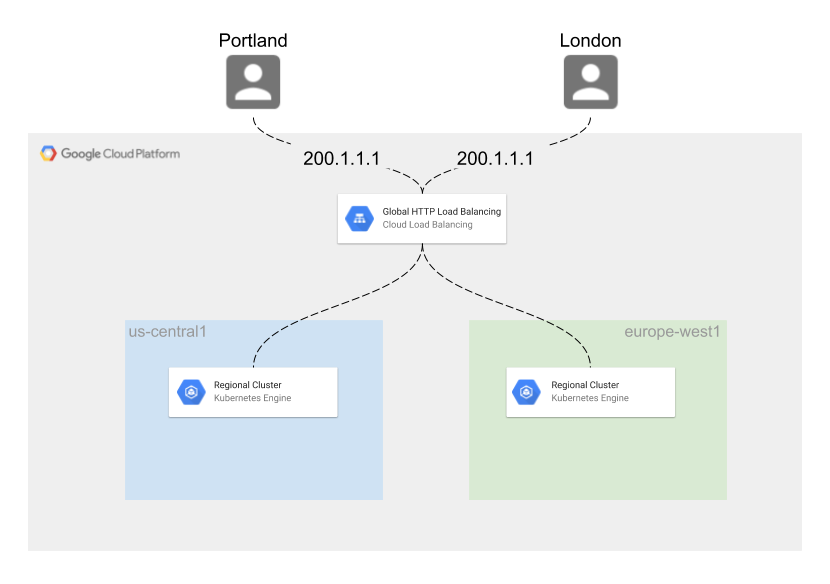

# Multi-Region GKE Demo
Deploy a service to geographically distributed GKE clusters with a GLB



**NOTE**: This demo creates two 3-node GKE clusters that should not be used for production purposes. The node pools are created as part of the `google_container_cluster` resource, and all the VMs will be terminated and recreated whenever the cluster is updated. (For best practices, see: [Using GKE with Terraform](https://www.terraform.io/docs/providers/google/guides/using_gke_with_terraform.html))

## Prerequisites

It is recommended that you run this demo in Cloud Shell, which already includes all the necessary software packages used in this demo. If you are running the demo on your workstation, then ensure the following tools are installed:
* [Google Cloud SDK](https://cloud.google.com/sdk/install)
* [jq](https://stedolan.github.io/jq/download/)
* [kubectl](https://kubernetes.io/docs/tasks/tools/install-kubectl/)
* [Terraform](https://www.terraform.io/downloads.html) (Version 0.12.0 or higher)

## Getting Started

1. Clone the git repo and navigate to `gke-multi-region-demo/terraform`.
2. Update the "project" variable in `terraform.tfvars` with your GCP Project ID. Optionally update the "region1" and "region2" variables to your preferred GCP regions.
3. Run the following Terraform steps to provision the two GKE clusters as well as an IAM Service Account.
    ```bash
    terraform init
    terraform apply
    ```
4. Retrieve the Service Account key from the Terraform outputs and write it to a file named `key.json` in your current directory. 
    ```bash
    terraform output -json service_account_key | jq '.rendered' > key.json
    ```
 5. Find the URIs for your clusters.
    ```bash
    gcloud container clusters list --uri
    ```
 6. Register the gke-eu cluster to GKE Hub using the Service Account key-file `key.json`.
    ```bash
    gcloud container hub memberships register gke-eu \
        --project=<project-id> \
        --gke-uri=<eu-cluster-uri> \
        --service-account-key-file=key.json
    ```
7. Repeat step #6 for the gke-us cluster.
   ```bash
   gcloud container hub memberships register gke-us \
       --project=<project-id> \
       --gke-uri=<us-cluster-uri> \
       --service-account-key-file=key.json
   ```
8. Verify that you have successfully registered your clusters with GKE Hub.
   ```bash
   gcloud container hub memberships list
   ```
9. To deploy the Global HTTP Load Balancer and web service, follow the steps in [Deploying Ingress across clusters
](https://cloud.google.com/kubernetes-engine/docs/how-to/ingress-for-anthos). 

   **NOTE**: All of the YAML files used in the tutorial are located in `/kubernetes`.

## Cleanup

To avoid "orphaned" resources, delete the demo services in the following order:

```bash

# navigate to /kubernetes
cd kubernetes

# set context to gke-us cluster
kubectl config use-context <us-cluster>

# delete MCI and GLB 
kubectl delete -f mci.yaml

#delete MCS
kubectl delete -f mcs.yaml

# delete the zoneprinter app in each cluster
kubectl delete -f deploy.yaml \
--context <us-cluster>

kubectl delete -f deploy.yaml \
--context <eu-cluster>

# delete the Namespace in each cluster
kubectl delete -f namespace.yaml \
--context <us-cluster>

kubectl delete -f namespace.yaml \
--context <eu-cluster>

# unregister each cluster from GKE Hub
gcloud container hub memberships unregister gke-us

gcloud container hub memberships unregister gke-eu

# navigate to /terraform
cd ../terraform

# delete terraform resources
terraform destroy
```
